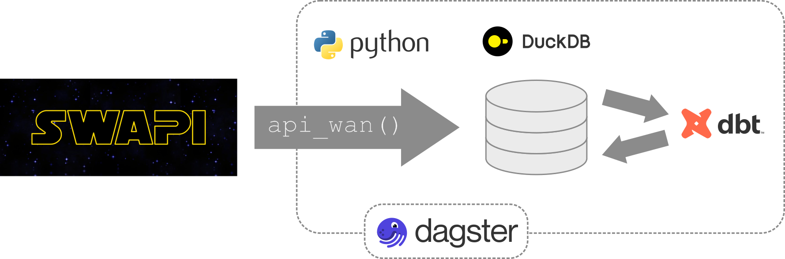

# SWAPY

<br/>

The aim of SWAPY is to create and deploy a data pipeline to extract data from [SWAPI](https://swapi.dev), load it to a database, and transform data into production ready datasets. In doing so, it demonstrates the use of several data stack components whilst maintaining a philosophy or minimising complexity &mdash; there is enough going on in the pipeline to integrate all the components, but not more. It is a Python-based project which includes:

- [x] Git for version control
- [x] Poetry for dependency management
- [x] Dagster for orchestration
- [x] dbt for transformation
- [ ] Streamlit for deployment




<!-- 
Other components I might add at a later date:

- dlt for extract/load
- GitHub actions for deployment
- OpenMetadata for data governance
-->

<br/>


## Prerequisites

1. Install Python
1. Install [Poetry](https://python-poetry.org/docs/)
1. Install Git
1. Create a GitHub account

<br/>


## Start up

The first components to implement are version control and dependency management via git, github and poetry.

1. Create a GitHub repo called `swapy`

1. Create a local poetry project called `swapy`

    ```bash
    poetry new `swapy`
    ```

1. Add git to the local `swapy` directory and connect to GitHub

    ```bash
    cd swapy
    git init
    echo "# SWAPY" >> README.md
    echo ".env" >> .gitignore
    git add .
    git commit -m 'initial'
    git remote add origin git@github.com:robgriffin247/swapy.git
    git branch -M main
    git push -u origin main
    ```

1. Create a .env file with the following environmental variables

    ```
    DUCKDB_PATH=data/swapi.duckdb
    SCHEMA_STG=staging
    SCHEMA_INT=intermediate
    ```
    
<br/>


## Extract and load SWAPI data

1. Starting from `swapy` at the root of the project and with the Poetry shell active, create `data` directory and `api_wan` module

    ```bash
    mkdir swapi data
    touch api_wan/__init__.py
    ```

1. Create `api_wan.py` as a function to request the data and load it to the database

    ```python
    # api_wan(): load raw swapi data to duckdb
    import httpx 
    import pandas as pd
    import os
    import duckdb

    def api_wan(resource):
        url = f"https://swapi.dev/api/{resource}"
        content = [] 

        while url != None:

            print(f"Getting {url}")
            response = httpx.get(url, timeout=90)
            response.raise_for_status
            response_json = response.json()

            url = response_json["next"]
            content = content + [item for item in response_json["results"]]

        df = pd.DataFrame.from_dict(content)

        query = f"""
                create or replace table {os.getenv('SCHEMA_STG')}.stg_{resource} as (
                    select
                        *
                    from df
                );
            """
        with duckdb.connect(f"{os.getenv('DUCKDB_PATH')}") as con:
            con.sql(f"create schema if not exists {os.getenv('SCHEMA_STG')};")
            con.sql(query)
            con.sql(f"select * from {os.getenv('SCHEMA_STG')}.stg_{resource}").show()
    ```

1. Create `_testing_.py` in the main project `swapy` directory and run to make sure `api_wan()` loads the data to the database correctly

    ```python
    from api_wan.api_wan import api_wan
    import duckdb
    import os

    api_wan("films")

    with duckdb.connect(f"{os.getenv('DUCKDB_PATH')}") as c:
        c.sql("show all tables").show()
    ```


## Add orchestration with Dagster

1. Start from the `swapy` project root directory with the Poetry shell active, add `dagster`, `dagster-webserver`, `httpx` and other dependencies to the project

    ```bash
    poetry add dagster dagster-webserver httpx dagster-duckdb dagster-duckdb-pandas
    ```
    Note it may need modification of the Python version in `pyproject.toml` to `>=3.10,<3.13 ` for dagster to install. The `pyproject.toml` file should now look something like:

    ```
    python = ">=3.10,<3.13"
    ...
    ```

1. Add `dags` and `dags/assets` modules

    ```
    mkdir dags dags/assets
    touch dags/__init__.py dags/assets/__init__.py
    ```

1. Add the `dags` module to `swapy/pyproject.toml`

    ```
    [tool.dagster]
    module_name = "dags"
    ```

1. [Import the assets](https://discuss.dagster.io/t/8804962/trying-to-import-my-own-repo-and-receiving-this-error-dagste) by populating the `dags/__init__py` file with

    ```python
    from dagster import (
        Definitions,
        ScheduleDefinition,
        define_asset_job,
        load_assets_from_package_module,
    )

    from . import assets

    daily_refresh_schedule = ScheduleDefinition(
        job=define_asset_job(name="all_assets_job"), cron_schedule="0 0 * * *"
    )

    defs = Definitions(
        assets=load_assets_from_package_module(assets), schedules=[daily_refresh_schedule]
    )
    ```

1. Define an asset

    ```python
    from .api_wan import api_wan
    from dagster import asset
    import os 

    @asset(group_name=f"{os.getenv('SCHEMA_STG')}")
    def stg_films() -> None:
        """Raw films data from swapi api, json data stored as a table via a pandas dataframe"""
        api_wan("films")
    ```

1. Spin up a dagster webserver

    ```bash
    dagster dev
    ```

1. Materialise the dataset by clicking [Materialize](http://127.0.0.1:3000/asset-group) in the browser, and check it is in the database

<br/>


## Extending the pipeline

At this point, the data pipeline has a start point &mdash; the films data from SWAPI stored locally created by the `api_wan()` function and an ingestion `stg_films.py` file. The next step is to extend the pipeline towards production ready datasets. 


1. Add the dbt dependencies (starting from `swapy` in the terminal)

    ```bash
    poetry add dbt dbt-core dbt-duckdb dagster-dbt
    ```

1. Initialize a dbt project called `dbts` and select the duckdb adapter

    ```bash
    dbt init dbts
    ```

1. Modify the `dbts/dbt_project.yml` file to set database and schema

    ```yml
    models:
      dbts:
        +database: swapi
        intermediate:
          +materialized: view
          +enabled: true
          +schema: "{{ env_var('SCHEMA_INT') }}"
    ```

1. Add the `dbts/profiles.yml` file to

    ```yml
    dbts:
      target: dev
      outputs:
        dev:
          type: duckdb
          path: "../{{ env_var('DUCKDB_PATH') }}"
    ```
1. Add a `models/source.yml` file

    ```yml
    version: 2
    sources:
    - name: "{{ env_var('SCHEMA_STG') }}"
      description: Raw swapi data
      schema: "{{ env_var('SCHEMA_STG') }}"
      tables:
      - name: stg_films
    ```

1. Add suitable SQL files to  `models/intermediate`, e.g.

    ```sql
    -- int_films
    select
        title,
        episode_id as episode,
        opening_crawl,
        director,
        producer as producers,
        release_date as release_date_us,
        created as created_date,
        edited as edited_date
    from {{ source('staging', 'stg_films') }}
    ```

    And suitable `schema.yml` files to each folder

    ```yml
    version: 2

    models:
      - name: int_films
        description: "Intermediate dataset of films"
        columns:
          - name: title
            description: "Film title"
          - name: episode_id
            description: "Episode number"
          - name: opening_crawl
            description: "Text of the opening scene setting crawl that occurs at the start of the movie"
          - name: director
            description: "Director(s) of the film, comma separated if >1"
          - name: producers
            description: "Producer(s) of the film, comma separated if >1"
          - name: release_date_us
            description: "Date of film release in US, formatted as yyyy-mm-dd"
          - name: created_date
            description: "Date record was created in SWAPI, formatted as yyyy-mm-ddThh:mmm:ss"
          - name: edited_date
            description: "Date record was last edited in SWAPI, formatted as yyyy-mm-ddThh:mm:ss"
    ```

1. Delete the `models/example` folder

1. `cd` to `dbts` and run `dbt build` &mdash; this should create the `int_films` in the database


## Integrate Dagster and dbt

1. Populate `dags/definitions.py`. Note the `load_assets_from_modules()` used to connect the dagster `staging` assets.

    ```python
    from pathlib import Path

    from dagster import AssetExecutionContext, Definitions, load_assets_from_modules, ExperimentalWarning
    from dagster_dbt import (
        DbtCliResource,
        DbtProject,
        build_schedule_from_dbt_selection,
        dbt_assets,
    )


    import warnings
    warnings.filterwarnings("ignore", category=ExperimentalWarning) 

    from dags.assets import stg_films
    staging_assets = load_assets_from_modules([stg_films])


    RELATIVE_PATH_TO_MY_DBT_PROJECT = "../dbts"

    my_project = DbtProject(
        project_dir=Path(__file__)
        .joinpath("..", RELATIVE_PATH_TO_MY_DBT_PROJECT)
        .resolve(),
    )


    @dbt_assets(manifest=my_project.manifest_path)
    def my_dbt_assets(context: AssetExecutionContext, dbt: DbtCliResource):
        yield from dbt.cli(["build"], context=context).stream()


    my_schedule = build_schedule_from_dbt_selection(
        [my_dbt_assets],
        job_name="materialize_dbt_models",
        cron_schedule="0 0 * * *",
        dbt_select="fqn:*",
    )

    defs = Definitions(
        assets=staging_assets + [my_dbt_assets],
        schedules=[my_schedule],
        resources={
            "dbt": DbtCliResource(project_dir=my_project),
        },
    )
    ```

1. Add [table metadata](https://docs.dagster.io/integrations/dbt/reference#upstream-dependencies) to `source.yml`

    ```yml
    version: 2
    sources:
    - name: "{{ env_var('SCHEMA_STG') }}"
      description: Raw swapi data
      schema: "{{ env_var('SCHEMA_STG') }}"
      tables:
      - name: stg_films
        meta:
          dagster:
            asset_key: ["stg_films"]
    ```

1. Add metadata to `dbt_project.yml`

    ```yml
    ...
    models:
      dbt_swapy:
        +database: swapi
        intermediate:
          +meta:
            dagster:
              group: "{{ env_var('SCHEMA_INT') }}" 
          +materialized: view
          +enabled: true
          +schema: "{{ env_var('SCHEMA_INT') }}"
    ```

1. Start dagster server calling the `definitions.py` file

    ```python
    dagster dev -f dags/definitions.py
    ```

1. Materialize the assets

-----

<br/>

This (should) be everything and the pipeline can now be populated with more assets as needed. At this point, it is a working example of a barebones data pipeline taking raw SWAPI data into a DuckDB database using dbt for transformation and Dagster for orchestration.